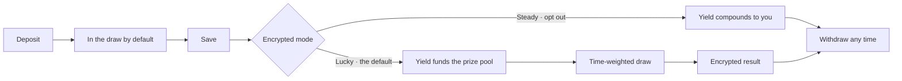
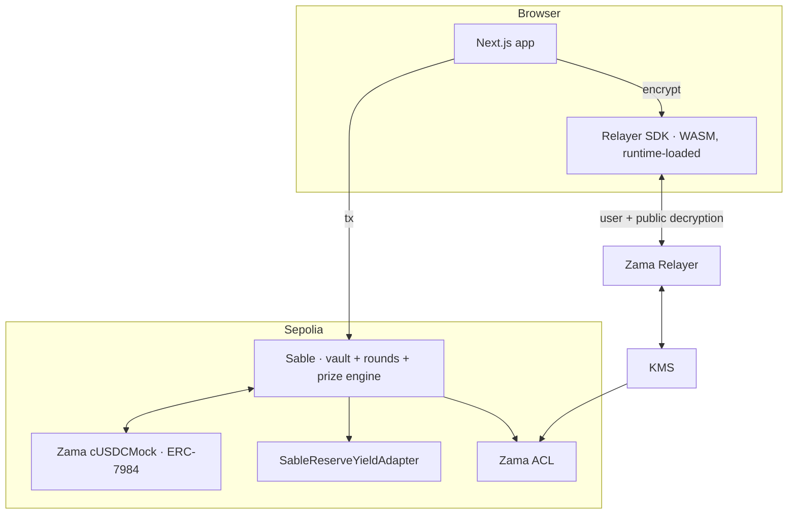

<div align="center">

# SABLE

**Save privately. Win fairly.**

A confidential prize-linked savings protocol built on Zama FHE.
Deposit privately, and **privately choose** whether your yield compounds or funds a
verifiable prize draw.

### [**Try it live →**](https://sable-inky.vercel.app)

[Ethereum Sepolia](https://sepolia.etherscan.io) · [Zama Protocol](https://zama.ai) ·
134 contract tests · 101 browser tests · 21 unit tests

</div>

---

## What Sable is

**A confidential PoolTogether.** Savers deposit into a shared pool, the yield funds periodic
prize draws, and principal can be withdrawn at any time — with deposits, balances, odds and
winnings encrypted end to end, and winner selection executing over encrypted balances while
the draw stays publicly auditable.

| | Public prize savings | Sable |
| --- | --- | --- |
| Your deposit amount | Visible | Encrypted |
| Your balance | Visible | Encrypted |
| Your odds of winning | Visible | Encrypted |
| Who won, and how much | Visible | Only the winner can decrypt |
| Prize pool and tiers | Visible | **Visible** — published on purpose |
| Draw randomness | Verifiable | Verifiable, and unreadable by whoever runs the draw |
| Withdraw any time | Yes | Yes |

The last two rows are the point. Confidentiality is applied to positions, not to mechanics:
everything needed to check that a round was run fairly stays public, and nothing that reveals
a saver's finances does.

**Lucky mode is the PoolTogether-equivalent behaviour** — your yield funds the pool and your
savings earn time-weighted entry into the draw. **Steady is the addition**, and it exists
because FHE makes it possible; see below for why a *private* opt-in is a different product
from a public one.

---

## Live deployment

| | |
| --- | --- |
| **App** | **https://sable-inky.vercel.app** |
| Network | Ethereum Sepolia (11155111) |
| `Sable` | [`0x6bdd702c44Da01b12997724DA7960555B2DF1c0b`](https://sepolia.etherscan.io/address/0x6bdd702c44Da01b12997724DA7960555B2DF1c0b#code) — source verified |
| `SableReserveYieldAdapter` | [`0x40eFC3209626CAa134ec77B7bF5a301121918EDf`](https://sepolia.etherscan.io/address/0x40eFC3209626CAa134ec77B7bF5a301121918EDf#code) — source verified |
| Asset | [`cUSDCMock`](https://sepolia.etherscan.io/address/0x7c5BF43B851c1dff1a4feE8dB225b87f2C223639) — Zama's published ERC-7984 wrapper |
| Underlying | [`USDCMock`](https://sepolia.etherscan.io/address/0x9b5Cd13b8eFbB58Dc25A05CF411D8056058aDFfF) — mintable by anyone |

Nothing is required to look around: the landing page, the public
[draw ledger](https://sable-inky.vercel.app/draws) and every completed round are readable
without a wallet.

**To use it**, connect a wallet on Sepolia and press **Get test tokens** in the app bar — it
mints 10,000 `USDCMock` to you, with no cooldown and no allowlist. Shield some into
`cUSDCMock`, deposit, and you are in the next draw; new positions open in Lucky, so no further
step is needed.

Rounds are opened and settled by a keeper on a schedule, but nothing waits for it: every
lifecycle call is permissionless, and the overview offers a **Start round** button when none
is open.

---

## 1. The problem

Every on-chain savings protocol publishes your balance. Prize-linked savings protocols
publish something worse: **your choice to participate**.

That second leak is the one nobody addresses. You can encrypt a balance and still broadcast
the decision beside it — because opting into a draw usually means calling a different
function, and a function selector is plaintext. An observer who cannot read your balance can
still read your appetite for risk, your engagement with a product, and the timing of both.

## 2. The solution

Sable encrypts the balance **and the choice**.

- **Lucky** — your yield goes to a shared prize pool, and your savings earn time-weighted
  entry into that round's confidential draw. This is prize-linked saving as it normally
  works, with the position encrypted.
- **Steady** — your yield compounds into your own savings position instead. This is the part
  that only works under encryption: an opt-out anyone can see is itself a disclosure.

Principal is untouched either way. There is one function, taking one opaque ciphertext:

```solidity
function setMode(externalEbool encryptedMode, bytes calldata inputProof) external;
```

No `enableLucky()`. No mode in any event. No branch anywhere in the protocol that an observer
could time. Steady and Lucky produce **byte-identical calldata shapes and identical logs** —
asserted by a test that submits both and compares them.

## 3. Why FHE

Sable needs to compute on values it must never see:

| It must compute | Over encrypted |
| --- | --- |
| Yield accrual | balance |
| Draw eligibility | balance × time × **mode** |
| Ticket ranges | eligibility |
| Winner selection | random point vs. ticket range |
| Reward allocation | winner condition |

Zero-knowledge proofs prove things about data and discard it. Fully homomorphic encryption
**computes on data while it stays encrypted** — which is the primitive this product needs.

> This is FHE, not ZK. Sable uses ZK proofs for exactly one job — attesting that an encrypted
> input is well-formed — and the phrase "zero-knowledge privacy" appears nowhere in this
> project, because it would describe a different mechanism.

---

## 4. How it works



### Time-weighted eligibility

Weight is balance × time held, gated by the encrypted mode:

```solidity
roundWeight += FHE.select(isLucky, balance * elapsedMinutes, 0);
```

Depositing moments before a draw earns nothing — under a minute floors to zero units.
Switching mode is non-retroactive in both directions, because `setMode` checkpoints *before*
flipping the bit.

**Every saver is weighted, not filtered.** There is no minimum deposit and no ticket to buy:
one token deposited for an hour is a real, proportional claim on the prize. Depositing more
buys proportionally more of the ticket space, never exclusive access to it — the smallest
saver in a round can and does win the jackpot.

### Lucky is the default

A new position opens in Lucky:

```solidity
position.isLucky = FHE.asEbool(true);
```

Steady is what you opt *out* to. This is the right way round for a prize-linked savings
account — depositing is what enters you into the draw, and a saver who never touches the mode
screen is in the pool rather than quietly excluded from it. The alternative defaults somebody
into a product they did not come for.

Nothing about the choice is public in either direction. The default is a plaintext `true`
sealed at deposit; from the first `setMode` onward the bit is a ciphertext whose value is
indistinguishable from outside, and the weighting arithmetic runs identically for both modes.

### Prize tiers

1 jackpot · 3 mid · 10 small — parameterised per round, not hardcoded.

### The rollover

`FHE.randEuint64` **requires a power-of-two bound**. The ticket space is therefore a fixed
`2^k`, participants occupy part of it, and the rest stays unassigned.

```
0 ─────────────────────────────────────────────────────── 2^k
│ alice  │ bob │ carol │            unallocated            │
```

A jackpot point landing in unassigned space matches nobody, and the jackpot **rolls forward**.
That is not an error path bolted on afterwards — it is the unavoidable consequence of the
power-of-two constraint, surfaced as the feature it deserves to be. It is also what keeps the
ticket boundaries secret.

#### Sizing the domain

Two round parameters control two *independent* properties, and conflating them is the easiest
way to get this wrong:

```
weighting stays proportional up to   2^ticketBits / maxParticipants   tickets
fraction of the domain allocated  =  actualParticipants / maxParticipants
```

`ticketBits` sets the resolution. Each participant's share is capped at
`2^ticketBits / maxParticipants` so that no single saver can crowd out the rest, which means a
deposit above that cap stops earning additional tickets — above the ceiling the draw quietly
becomes uniform rather than deposit-weighted, and the brief's proportionality promise breaks.

`maxParticipants` sets how much of the domain a full round occupies. With ten slots and three
savers, 30% of the space is live and the jackpot rolls over the other 70% of the time.

An earlier configuration of `ticketBits = 16, maxParticipants = 50` failed on both counts:
weighting flattened above **3.6 cUSDC**, and three savers allocated 6% of the domain — a
jackpot rolling over 94% of rounds. The shipped defaults are **`ticketBits = 24`,
`maxParticipants = 10`**, giving proportional weighting to ~4,660 cUSDC and, with three savers,
jackpot/mid/small odds of roughly **30% / 66% / 97%** per round.

### Who advances a round

Every step of the lifecycle is **permissionless**: `openRound`, `closeRound`, the eligibility,
ticket, draw and settlement batches, and `completeRound`. None of them checks a role. Anybody
can push a round forward, and nobody can hold one hostage.

`configureRound` remains admin-only, and deliberately: it fixes the window, the tier shares and
the two domain parameters above. Opening it up would let anyone configure a thirty-day round
scored over a single participant.

So the admin lays out a calendar of rounds in advance and a keeper — running on a throwaway key
that holds no role, no ownership and no access to the reserve — opens and advances each one on
schedule. The keeper is a **convenience, not a dependency**: if it stops, the round stays open,
deposits keep working, weight keeps accruing, and the next thing to run the task completes the
round as normal. Principal stays withdrawable throughout.

```bash
pnpm exec hardhat rounds:schedule --network sepolia   # admin, once per week
pnpm exec hardhat keeper --network sepolia            # permissionless, any key with gas
```

`.github/workflows/keeper.yml` runs the second of these every fifteen minutes.

### Confidential winner selection

```solidity
ebool isWinner = FHE.and(FHE.ge(point, start), FHE.lt(point, stop));
reward = FHE.add(reward, FHE.select(isWinner, tierPrize, zero));
```

**Every participant is evaluated against every point, and every participant is written to.**
Losers receive an encrypted zero rather than being skipped. That symmetry is the privacy
property: no winners list, no event naming an address, and identical gas and storage patterns
whether you won or lost. You learn you won by decrypting your own reward; nobody else can
learn it at all.

---

## 5. Architecture



`SableAccessControl → SableCore → SableVault → SablePrizeEngine → Sable` compile into **one
deployed contract**. That is deliberate: ciphertexts do not cross contract boundaries for
free, and splitting the prize engine out would mean granting it transient access to every
participant's balance and mode on every batch — a larger ACL surface and more to audit, for a
tidier diagram. Full reasoning in [`docs/ARCHITECTURE.md`](docs/ARCHITECTURE.md).

### The FHE data model

| Value | Type | Readable by |
| --- | --- | --- |
| `balance`, `reward` | `euint64` | Owner only |
| `isLucky` | `ebool` | Owner only |
| `roundWeight`, ticket range | `euint64` | Owner only |
| Prize pool, tier amounts | `euint64` | **Public** after finalization |
| `_totalDeposits` | `euint64` | Nobody |

### Both decryption paths

| Path | Used for | Who |
| --- | --- | --- |
| **Public** — `makePubliclyDecryptable` → `publicDecrypt` | Round prize pool, tier amounts, rollover | Anyone, no wallet |
| **User** — ACL `allow` → EIP-712 → `userDecrypt` | Balance, mode, weight, rewards | The owning wallet only |

The public path is what lets `/draws` show **real prize figures to an anonymous visitor**
instead of redacted boxes. Individual positions never take it.

### ACL discipline

Permissions attach to **handles, not storage slots**, and every FHE operation produces a new
handle. A missed re-grant does not fail immediately — it fails on the account's *next*
interaction. So every persistent write goes through one helper:

```solidity
function _persist(euint64 value, address account) internal {
    FHE.allowThis(value);        // contract can keep computing on it
    FHE.allow(value, account);   // only the owner can decrypt it
}
```

---

## 6. The asset, and where yield comes from

### Sable custodies Zama's published asset, not its own

On Sepolia the vault holds **`cUSDCMock`** — Zama's canonical confidential test token
(`0x7c5BF43B851c1dff1a4feE8dB225b87f2C223639`), an `ERC7984ERC20Wrapper` over a publicly
mintable ERC-20. Every property was verified against the live chain rather than taken from
the docs: six decimals, `rate() == 1`, and an underlying `mint` open to anyone up to one
million per call.

A savings protocol that issues the very token it custodies invites an obvious question about
where the money comes from. Using the ecosystem's published asset removes it. The vault takes
any `IERC7984` in its constructor, so this costs nothing architecturally — the same bytecode
runs on either.

**Sable does not issue tokens.** The app does carry a *Get test tokens* button, and the
distinction matters: it calls the public `mint` on **Zama's** `USDCMock` — the ERC-20 their own
published wrapper names as its underlying — not on anything Sable deployed.

That address is derived rather than transcribed: ask the deployed vault for its `asset()`, then
ask that wrapper for its `underlying()`. Both contracts had bytecode long before Sable's first
deployment, and the mint is genuinely permissionless — simulating it from an address with no
balance and no role succeeds, and a node prices the call at 51,945 gas.

The button sits in the app bar on every page, not only in an empty state — it used to vanish
the moment it had worked, which is exactly when somebody running the flow a second time goes
looking for it. There is no per-wallet limit to enforce: Zama's mock is permissionless with no
cooldown, so the cap is per press and pressing it five times mints five times.

Each press is capped at 10,000 tokens. Zama left the mint unrestricted, which is reasonable for
a testnet mock and unreasonable as a button in a savings product; the cap makes it read as a
faucet rather than a money printer. The same call is available as `npx hardhat faucet` — it is
what funded the yield reserve.

What the app *does* implement is the boundary between the public token economy and the
confidential one, in **both directions**:

| Direction | Flow |
| --- | --- |
| **Wrap** | `approve` → `wrap`. Two transactions. Zama recommends the single-transaction ERC-1363 `transferAndCall` path, but the default asset's underlying has no such selector in its bytecode, so the documented fallback is the only route. |
| **Unwrap** | `unwrap` → `publicDecrypt` → `finalizeUnwrap`. Genuinely asynchronous: the confidential amount is burned first and the underlying released only once the cleartext and its KMS proof are supplied. |

Unwrapping matters more than it looks. Without it Sable would be a **one-way door** — a saver
could withdraw from the vault and still hold a confidential token with no route back to the
public one.

It is also the one place a *public* decryption of a personal amount is correct rather than a
leak: the released figure is about to appear as an ordinary ERC-20 transfer, so it cannot
stay secret. The contract re-verifies the KMS signatures with `FHE.checkSignatures` before
releasing anything.

Because the burn and the release are separate transactions, an interrupted unwrap leaves
value recoverable but unadvertised. The app detects a pending request and offers to complete
it; the indexer tracks open requests so nothing looks like it vanished.

### Yield is paid from a funded reserve

Sable cannot mint an asset it does not own, so yield comes from tokens somebody actually put
in. `SableReserveYieldAdapter` holds a reserve and pays from it.

Solvency is **enforced, not assumed**, and the reason is worth stating: an ERC-7984 transfer
is all-or-nothing and returns an encrypted zero rather than reverting, so a dry reserve would
have the vault crediting yield it never received — and *no later transaction could detect it*,
because every quantity involved is a ciphertext. The adapter therefore caps its own index:

```
maxIndexDelta = fundedTotal × INDEX_SCALE / coveredDeposits
```

where `coveredDeposits` is a public upper bound on everything the vault could ever custody.
Cumulative yield owed is bounded above by `fundedTotal` for all time, so the reserve cannot
run dry. An unfunded deployment simply accrues **no** yield rather than promising what it
cannot pay — asserted by a test.

Funding goes through the *public* ERC-20 leg and is wrapped by the adapter, because a
confidential transfer would leave the adapter unable to know how much it actually received.

It is real on-chain accrual — real tokens, a real rate, verifiable arithmetic. It is **not
external yield**: nobody is borrowing these savings and paying interest on them. The UI,
`/how-it-works` and this README all say so in those words, because a testnet product that
misrepresents where its yield comes from teaches exactly the wrong instinct.

Both adapters implement `ISableYieldAdapter`; a production deployment swaps in a real venue
and calls `setYieldAdapter`. Nothing in the vault changes.

### Why the index is public

FHEVM has **no encrypted-by-encrypted division**, so Sable cannot compute one saver's share of
a pooled return homomorphically. Publishing the *rate* and multiplying each encrypted balance
by a public delta is exact, costs one scalar multiply, and leaks a parameter rather than a
position.

It also makes principal safety **structural**: the pool can only be fed from
`select(isLucky, yield, 0)`, whose value is bounded by that interval's interest. No expression
anywhere moves principal into a reward.

---

## 7. Privacy: what is and is not protected

| Confidential | Public |
| --- | --- |
| Savings balance | Your address |
| Yield mode | Transaction timing |
| Deposit / withdrawal amounts | Which function you called |
| Draw eligibility and weight | Aggregate round data |
| Ticket range | Participant count |
| Prize results and rewards | Whether a jackpot rolled forward |

**Sable protects financial state. It does not make you anonymous.** Participation is public;
the position is not. Overstating this on a financial product is a safety problem, not a
marketing choice — see [`docs/PRIVACY_MODEL.md`](docs/PRIVACY_MODEL.md).

---

## 8. Measured performance

Batch sizes are derived from measurement, not assumption. The mock coprocessor enforces the
same ceilings as the live network, so these are real constraints:

| Operation | HCU | Per transaction |
| --- | --- | --- |
| `setMode` | 96 | — |
| `deposit` | 1,129,096 | — |
| `withdraw` | 1,129,032 | — |
| Eligibility, per account | 2,055,596 | 8 accounts |
| Ticket assignment, per account | 1,027,008 | 16 accounts |
| **Settlement, per account** | **7,560,448** | **2 accounts** |
| `finalizeRound` | 5,385,000 | — |

Against 20,000,000 global / 5,000,000 sequential-depth ceilings.

The brief suggested ~50 participants and said not to assume it. Fifty is achievable — it
simply takes ~25 settlement transactions. That is an operational cost, not a wall, which is
exactly why every phase is cursor-based and resumable. An oversized batch reverts *without
advancing the cursor*, verified by a test.

---

## 9. Non-negotiable invariants

| # | Invariant | Enforced by |
| --- | --- | --- |
| 1 | Principal never becomes another saver's prize | Pool fed only by `select(isLucky, yield, 0)` |
| 2 | Only Lucky yield funds the pool | The same expression |
| 3 | Plaintext mode never revealed | One function, one event, symmetric execution |
| 4 | Plaintext balance never revealed | ACL; only aggregates made public |
| 5 | Never distributes more than the pool | Config validation + floor division |
| 6 | Completed round cannot re-run | Guarded state machine |
| 7 | Reward cannot be credited twice | Atomic claim |
| 8 | No cross-account decryption | ACL grants only to the owner |

All eight are covered by tests in `test/invariants.ts`.

---

## 10. Repository

```
sable/
  apps/
    web/                 Next.js 16 · landing, app, ledger, admin
    indexer/             Public-metadata indexer (optional)
  packages/
    contracts/           Solidity + Hardhat + 101 tests
    config/              Chain, ABIs, addresses, formatting, shared types
  docs/
  deployments/
```

Addresses live in `@sable/config`, generated by `pnpm sync:abis`. **No address is pasted into
application source**, so "which address is the frontend using?" has exactly one answer. With
no deployment present the app renders its "not deployed" state — there is no placeholder
address and no demo mode.

---

## 11. Verified version matrix

`@fhevm/solidity` is pinned at **0.11.1**, not the newest `0.13.3`. This was checked, not
assumed: `0.13.x` fails to compile because `@fhevm/hardhat-plugin` *parses and rewrites*
`ZamaConfig.sol` and rejects the newer format. `@openzeppelin/confidential-contracts`
independently peers the same `0.11.1`.

| Package | Version |
| --- | --- |
| `@fhevm/solidity` | 0.11.1 |
| `@fhevm/hardhat-plugin` | 0.4.2 |
| `@zama-fhe/relayer-sdk` | 0.4.1 (contracts) / 0.4.4 (web) |
| `@openzeppelin/confidential-contracts` | 0.5.3 |
| Hardhat | 2.29.x (Hardhat 3 unsupported) |
| Solidity | 0.8.27, `cancun`, `viaIR` |

Also verified against installed source rather than tutorials: the config contract is
`ZamaEthereumConfig`, **not** `SepoliaConfig` (which does not exist in 0.11.1).

Full record: [`docs/ZAMA_IMPLEMENTATION_NOTES.md`](docs/ZAMA_IMPLEMENTATION_NOTES.md).

---

## 12. Quick start

```bash
pnpm install
pnpm contracts:compile
pnpm contracts:test          # 134 tests

cp .env.example .env         # add DEPLOYER_PRIVATE_KEY + SEPOLIA_RPC_URL
pnpm deploy:sepolia
pnpm sync:abis               # required — writes addresses into @sable/config
pnpm web:dev
```

Schedule rounds, then let the keeper run them:

```bash
cd packages/contracts
npx hardhat rounds:schedule --network sepolia    # admin: 28 x 6h on the calendar
npx hardhat keeper --network sepolia             # permissionless: opens, closes, draws, settles
```

`keeper` does whatever is currently possible and exits, so it is safe to run on a cron or by
hand. `.github/workflows/keeper.yml` runs it every fifteen minutes.

### Deployment and operations scripts

Every one lives in [`packages/contracts/tasks/`](packages/contracts/tasks/) and is a Hardhat
task, so `--help` works on all of them.

| Command | What it does | Who can run it |
| --- | --- | --- |
| `pnpm deploy:sepolia` | Deploys the adapter and vault in dependency order, wires them together, and writes `deployments/sepolia.json` | deployer |
| `pnpm sync:abis` | Exports ABIs and addresses into `@sable/config`. **Not optional** — it is the only writer of what the app and indexer read | — |
| `pnpm verify:sepolia` | Publishes source to Etherscan | needs `ETHERSCAN_API_KEY` |
| `reserve:fund --amount N` | Mints the public underlying, wraps it, and funds the yield reserve | admin |
| `yield:rate --bps N` | Sets the annual rate the reserve pays | admin |
| `rounds:schedule` | Lays out a calendar of future rounds | admin |
| `round:demo --minutes N` | One short round starting now, for a walkthrough | admin |
| `keeper` | Opens, closes, draws and settles whatever is due | **anyone with gas** |
| `faucet --amount N` | Mints test `USDCMock` | anyone |
| `demo:deposit --amount N` | Encrypts and deposits from the CLI, exactly as the browser does | anyone |

A full walkthrough, including the HCU-derived batch sizes and what to check after deploying,
is in [`docs/DEPLOYMENT.md`](docs/DEPLOYMENT.md).

---

## 13. Demo flow

1. Open Sable — no wallet needed for the landing page or `/draws`
2. Connect a Sepolia wallet
3. Bring cUSDCMock to the wallet — or bring USDCMock and **shield** as much of it as you
   want at `/app/deposit/shield`
4. Authorise the vault, then deposit an encrypted amount
5. **Open the transaction on Etherscan — the calldata contains no plaintext amount**
6. Reveal your balance via EIP-712
7. Set your mode to Lucky
8. **Set a second wallet to Steady, and compare: identical selector, identical calldata
   length, identical event**
9. Run a round
10. Open `/draws/1` in a private window with no wallet — real prize figures resolve
11. Reveal rewards on each wallet — only the owner can decrypt
12. Withdraw, then unwrap back to the public token — watch the three stages
13. Generate a statement — built locally; the network tab shows nothing transmitted

Steps 5 and 8 are the ones that actually prove the product's claims.

---

## 14. Environment

```env
NEXT_PUBLIC_CHAIN_ID=11155111
NEXT_PUBLIC_RPC_URL=
NEXT_PUBLIC_SABLE_ADDRESS=
NEXT_PUBLIC_CONFIDENTIAL_ASSET_ADDRESS=
NEXT_PUBLIC_YIELD_ADAPTER_ADDRESS=
NEXT_PUBLIC_WALLETCONNECT_PROJECT_ID=   # optional, see §16

DEPLOYER_PRIVATE_KEY=          # server-side only, never NEXT_PUBLIC_
SEPOLIA_RPC_URL=
ETHERSCAN_API_KEY=

DATABASE_URL=                  # indexer only
```

A single `.env` at the repository root configures every workspace. The web app loads the
`NEXT_PUBLIC_*` keys from it at build time (`apps/web/next.config.mjs`); nothing else in that
file is read into the bundle, so `DEPLOYER_PRIVATE_KEY` never enters a build.

See [`.env.example`](.env.example).

---

## 15. Assets and multi-token support

`/app/assets` lists every confidential asset Zama publishes on Sepolia, with the wallet's
balance on both sides of the wrapper:

| | Public balance | Shielded balance |
| --- | --- | --- |
| What it is | The ERC-20 beneath the wrapper | The ERC-7984 confidential balance |
| Who can read it | Anyone | Only the owning wallet |
| How it renders | Printed | Masked until an EIP-712 reveal |

Revealing costs **one signature** covering the listed assets, not one per token. The cached
authorisation holds a single contract set, so authorising per token would re-prompt on every
token — and again on the first as soon as a second replaced it. Masking stays per asset: a
saver checking one balance does not put the rest on screen.

**Token marks are drawn inline, never fetched.** Every token-list service serves logos from a
CDN, and using one would mean requesting an image per asset *from a page that lists what the
wallet holds* — the request pattern is the holdings. A test asserts no `img` on that page has
a remote `src`. They are also not the genuine brand logos: these are Zama's mock instruments,
and stamping the real USDC mark on one would imply an issuer relationship that does not exist.

### What "supported" means

Shielding works for **all eight** assets — `/app/deposit/shield?asset=<address>`, with the
address matched against the published registry rather than trusted from the URL.

Saving does not. The vault takes a single `IERC7984` in its constructor, so one deployment
custodies one asset; this one holds `cUSDCMock`. The assets page says so, and the shield page
warns before a saver spends two transactions reaching a deposit screen that cannot accept the
result. Supporting another asset is a deployment, not a code change: `pnpm deploy:sepolia
--asset <address>` with its own funded reserve.

---

## 16. Connecting a wallet

Sable ships two wallet choosers and picks between them on configuration alone.

| `NEXT_PUBLIC_WALLETCONNECT_PROJECT_ID` | Chooser | Reaches |
| --- | --- | --- |
| set | [Reown AppKit](https://reown.com/appkit) | Browser extensions, mobile wallets by deep link, phone wallets by QR |
| unset | Sable's own EIP-6963 picker | Browser extensions, by name |

The fallback is deliberate. AppKit cannot start without a project id, so a clone of this
repository with no configuration would otherwise have no way to connect a wallet at all. The
built-in picker needs no external service and handles extensions perfectly well; what it
cannot do is mobile QR pairing. Nobody hits a dead end for lack of an account somewhere.

A project id is public by design — it ships in the browser bundle and is not a secret. Get a
free one from [cloud.reown.com](https://cloud.reown.com) and use your own: usage is billed and
rate-limited against its owner, and an id copied from a tutorial can be revoked without notice.

**Why AppKit and not RainbowKit or ConnectKit.** Both were evaluated first and neither installs
on this stack — RainbowKit peers `wagmi@^2.9.0` and ConnectKit peers React 17/18, while Sable
runs wagmi 3 and React 19. AppKit's modal is built from Lit web components, so it declares no
React peer dependency at all and its wagmi adapter accepts `wagmi >= 2.19.5`.

**Two of its dependencies are aliased out of the bundle** in `apps/web/next.config.mjs`:

- `@base-org/account` and `@coinbase/wallet-sdk` reported every visitor to
  `cca-lite.coinbase.com` on page load, before any wallet was chosen, carrying
  device-fingerprinting signals. AppKit's `enableCoinbase` / `enableBaseAccount` flags stop the
  connectors being registered but were measured not to stop the reporting. The Coinbase Wallet
  *extension* still appears in the list — it announces itself over EIP-6963 like any other.
- `@x402/*` are optional peer dependencies of `@coinbase/cdp-sdk` that Turbopack resolves
  statically and fails the build on, though the code around them is unreachable here.

A test in `apps/web/e2e/smoke.spec.ts` fails if any analytics host is contacted before a wallet
connects, so an upgrade cannot quietly reintroduce this.

---

## 17. Testing

```bash
pnpm contracts:test                     # 134 contract tests
pnpm --filter @sable/web typecheck
pnpm --filter @sable/web e2e            # 97 browser tests
pnpm --filter @sable/web test           # 21 unit tests
```

The browser suite asserts things a build cannot — that no fabricated prize amounts appear,
that empty states are honest rather than seeded, and that the privacy page keeps its
metadata-leakage section. The no-fake-data rule is **mechanically enforced**, not left to
discipline.

See [`docs/TESTING.md`](docs/TESTING.md).

---

## 18. Documentation

| Document | Contents |
| --- | --- |
| [`ZAMA_IMPLEMENTATION_NOTES.md`](docs/ZAMA_IMPLEMENTATION_NOTES.md) | Verified version matrix and API surface |
| [`ARCHITECTURE.md`](docs/ARCHITECTURE.md) | Contract design and data flow |
| [`FHE_SECURITY.md`](docs/FHE_SECURITY.md) | Ciphertext permissions, overflow, leakage audit |
| [`PRIZE_ENGINE.md`](docs/PRIZE_ENGINE.md) | Weighting, tickets, draw, rollover |
| [`PRIVACY_MODEL.md`](docs/PRIVACY_MODEL.md) | What is protected, what is not |
| [`TESTING.md`](docs/TESTING.md) | Test architecture and coverage |
| [`DEPLOYMENT.md`](docs/DEPLOYMENT.md) | Sepolia deployment and operations |

---

## 19. Status and limitations

Stated plainly rather than left to be discovered:

- **Testnet only.** Zama's `cUSDCMock` is a test asset with no value and is not redeemable.
- **Not audited.** No third party has reviewed this code.
- **Yield is sponsor-funded, not sourced from a market.** See §6.
- **Small anonymity sets.** With few participants, aggregates and timing correlate more
  strongly with individuals than encryption alone suggests.
- **Yield is a mock, and deliberately so.** No lending market on Sepolia pays a real return on
  a confidential token, so the rate is set by an admin and paid from a funded reserve. See §6:
  the adapter refuses to credit more than the reserve provably covers, which is what keeps
  "sponsored yield" from quietly becoming an IOU.
- **The keeper needs a secret before it runs.** `.github/workflows/keeper.yml` is scheduled
  but skips without `KEEPER_PRIVATE_KEY`. Rounds still advance — anybody can run the task —
  but they will not advance *on time* until that is set.

Addresses are at the top of this file. The reserve is funded with 1,000,000 cUSDCMock, and a
calendar of rounds is scheduled ahead. The app reads the addresses from the generated
deployment record, so a fresh clone needs no configuration.

---

## 20. License

MIT. See [LICENSE](LICENSE).

---

<div align="center">

**Sable** — Save privately. Win fairly.

Built with the Zama Protocol on Ethereum Sepolia.

</div>
