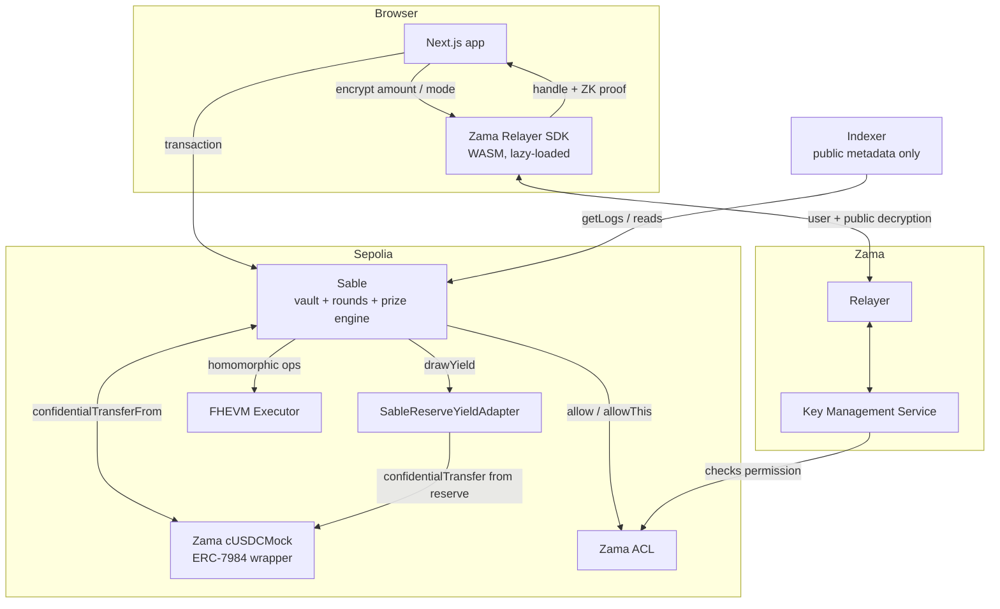
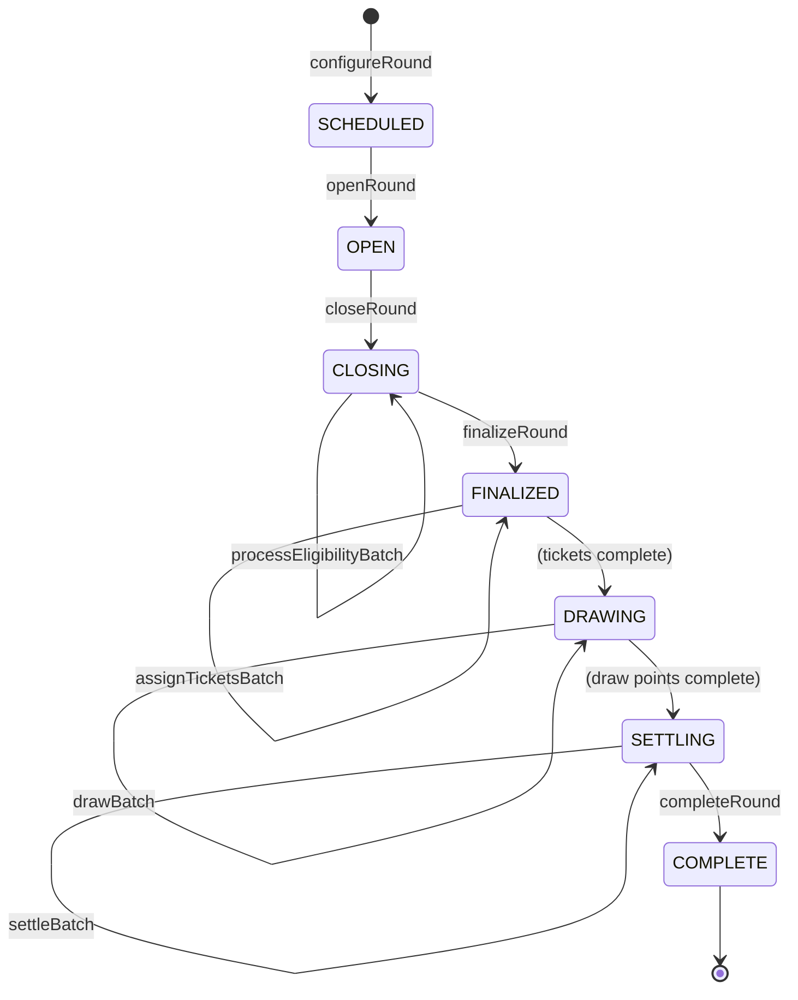

# Architecture

How Sable is put together, and why it is put together this way. Where a decision looks
unusual, the reasoning is stated — including the cases where the conventional approach was
tried first and abandoned.

---

## 1. System overview



---

## 2. Contract layout

```
contracts/
  Sable.sol                          concrete deployment
  core/
    SableAccessControl.sol           admin role + pause (OPERATOR_ROLE is vestigial)
    SableCore.sol                    storage, checkpointing, yield, ACL helper
    SableVault.sol                   deposit, withdraw, mode, rewards
    SablePrizeEngine.sol             rounds, tickets, draw, settlement
  token/
    SableConfidentialUSD.sol         ERC-7984 asset, local development only
  adapters/
    SableReserveYieldAdapter.sol     reserve-backed yield (external asset)
    SableTestnetYieldAdapter.sol     mint-backed yield (self-issued asset)
  mocks/
    MockUnderlyingUSD.sol            local stand-in for Zama's mintable ERC-20
    MockConfidentialUSDWrapper.sol   local stand-in for cUSDCMock
  interfaces/ISableYieldAdapter.sol
  libraries/
    SableErrors.sol                  every custom error
    SableTypes.sol                   enums and structs
    SableMath.sol                    plaintext constants and helpers
```

### Why the core is one deployed contract

`SableCore → SableVault → SablePrizeEngine → Sable` is an inheritance chain, not four
deployments. That is a deliberate reversal of the usual "one concern, one contract"
instinct, and the reason is specific to FHE:

**Ciphertexts do not cross contract boundaries for free.** Every handle passed between
contracts needs an `FHE.allowTransient` grant on the way out and a permission check on the
way back, on every call, in both directions. A separate prize-engine contract would need
transient access to every participant's balance and mode on every settlement batch. That is
a strictly larger ACL surface, more homomorphic work, and considerably more to audit — in
exchange for a diagram that looks tidier.

Keeping all confidential state inside one ACL domain is both cheaper and safer. The
deployed contract is 17,170 bytes, about 70% of the EIP-170 limit, so the consolidation
costs nothing in headroom.

The contracts that genuinely are separate are the ones with genuinely separate trust
boundaries: the asset (a token anyone can hold independently of Sable) and the yield adapter
(swappable without touching the vault).

---

## 3. The confidential data model

| Value | Type | Who can read it |
| --- | --- | --- |
| `balance` | `euint64` | Owner only |
| `reward` | `euint64` | Owner only |
| `isLucky` | `ebool` | Owner only |
| `roundWeight[round][account]` | `euint64` | Owner only |
| `ticketStart` / `ticketEnd` | `euint64` | Owner only |
| `prizePool[round]` | `euint64` | **Public** after finalization |
| `jackpotPrize` / `midPrize` / `smallPrize` | `euint64` | **Public** after finalization |
| `rollover` / `jackpotHit` | `euint64` / `ebool` | **Public** after completion |
| `_totalDeposits` | `euint64` | Nobody — contract-internal only |

Everything monetary is `euint64`, matching ERC-7984 exactly so no cast is ever needed at the
token boundary.

Round-scoped confidential state lives in `roundId => account => handle` mappings rather than
inside the position struct. A new round therefore starts clean with no O(participants) reset,
and a completed round's allocation stays independently auditable afterwards.

---

## 4. Round lifecycle



Every transition is guarded and invalid ones revert with
`InvalidRoundState(roundId, actual, expected)`. `OPEN → COMPLETE` is unreachable. A phase
cannot advance while a previous phase has unprocessed items, enforced by comparing cursors
against the participant count snapshotted at close.

### The snapshot that makes batching safe

`closeRound` records `participantCount`. Every subsequent cursor is measured against that
snapshot rather than against the live registry, so accounts registering during settlement
cannot shift indices under a running batch. The participant array is append-only for the
same reason: indices must stay stable for the duration of a round.

---

## 5. The checkpoint

Every state-changing user operation runs `_checkpoint(account)` **before** mutating anything.
Both accruals are integrals over the interval that just ended, and both must be evaluated
against the values in force *during* that interval. Checkpointing afterwards would
retroactively re-price history — which is exactly the draw-sniping vector time-weighting
exists to close.

```solidity
function _checkpoint(address account) internal {
    _accrueWeight(account, position);   // balance × elapsed, gated by encrypted mode
    _accrueYield(account, position);    // balance × public index delta, routed by mode
    lastCheckpointAt[account] = block.timestamp;
}
```

Weight is computed before yield, so an interval's weight reflects the balance actually held
throughout it rather than one that already includes that interval's interest.

---

## 6. Yield: why the index is public

FHEVM has **no encrypted-by-encrypted division**. Sable therefore cannot compute one saver's
share of a pooled return homomorphically — the divisor would itself be a ciphertext.

The alternative is a public index. Each encrypted balance is multiplied by a public delta,
which is exact and costs a single scalar multiply:

```solidity
euint64 earned = FHE.div(FHE.mul(balance, indexDelta), INDEX_SCALE);
euint64 steady = FHE.select(isLucky, zero,   earned);   // compounds into balance
euint64 lucky  = FHE.select(isLucky, earned, zero);     // funds the prize pool
```

This leaks the protocol's *rate*, which is a parameter, and never a position.

It also makes principal safety structural rather than promised: the prize pool can only be
fed from the `lucky` branch, whose value is bounded above by that interval's interest. No
expression anywhere in the protocol moves principal into a reward.

### The asset

On Sepolia the vault custodies **Zama's published `cUSDCMock`**
(`0x7c5BF43B851c1dff1a4feE8dB225b87f2C223639`) rather than a token Sable issues. The vault
takes any `IERC7984` in its constructor, so this required no change to it — only to the
adapter, since Sable cannot mint an asset it does not own.

Local chains have no such contract, so `deploy:sable` deploys `SableConfidentialUSD` there
instead. The mocks mirror the deployed pair's shape exactly (six decimals, `rate() == 1`,
public mint capped at one million) so the wrapper path is exercised in tests.

### Where the yield actually comes from

Two adapters, both behind `ISableYieldAdapter`:

| Adapter | Used when | Yield source |
| --- | --- | --- |
| `SableReserveYieldAdapter` | The asset is external (Sepolia) | A pre-funded reserve |
| `SableTestnetYieldAdapter` | Sable issued the asset (local) | Direct issuance |

The reserve adapter caps its own index at what the reserve provably covers:

```
maxIndexDelta = fundedTotal × INDEX_SCALE / coveredDeposits
```

This matters more than it looks. An ERC-7984 transfer is all-or-nothing and returns an
encrypted zero rather than reverting, so a dry reserve would leave the vault crediting yield
it never received — and nothing downstream could detect it, because every quantity involved
is a ciphertext. Bounding the index makes exhaustion impossible rather than merely unlikely.

Funding takes the *public* ERC-20 and wraps it, because a confidential transfer would leave
the adapter unable to know how much it received.

Either way it is real on-chain accrual — real tokens, a real rate — but **not external
yield**: nobody is borrowing these savings and paying interest.

The adapter is behind `ISableYieldAdapter`, so a production deployment swaps it for a real
venue and calls `setYieldAdapter`. Nothing in the vault changes; it only ever consumes a
public index and a delivery call.

---

## 7. The token boundary

Three properties of ERC-7984 shaped the vault:

1. **Balances are `euint64`.** Sable uses the same type throughout.
2. **Transfers are all-or-nothing.** `_update` returns `select(success, amount, 0)`, so an
   under-funded transfer moves *nothing* and does not revert. The vault credits the returned
   handle, never the requested amount — crediting the request would let anyone mint savings
   balance by asking for more than they hold, with no revert to surface it.
3. **Approval is operator-based with an expiry**, not an allowance. The deposit flow is
   therefore `setOperator(vault, expiry)` then `deposit(...)`.

The balance ceiling is applied by clamping the request against remaining headroom *before*
the transfer, since an FHE branch cannot be taken conditionally:

```solidity
euint64 headroom = FHE.sub(MAX_CONFIDENTIAL_BALANCE, position.balance);
euint64 toTake   = FHE.min(requested, headroom);
FHE.allowTransient(toTake, address(asset));
euint64 credited = asset.confidentialTransferFrom(msg.sender, address(this), toTake);
```

---

## 8. Frontend architecture

```
apps/web/src/
  app/
    page.tsx              landing
    (public)/             how-it-works, privacy, security, docs
    draws/                public ledger + round verification
    app/                  authenticated dashboard
    admin/                operator dashboard
  components/
    ui/                   design system primitives
    landing/              landing sections
    app/                  authenticated components
    content/              long-form prose primitives
  lib/
    fhevm/instance.ts     Relayer SDK integration
    hooks/                reads, reveals, transactions, activity
    statement.ts          client-side PDF generation
```

The Relayer SDK is lazily imported and client-only. It ships a multi-megabyte WASM payload
for TFHE and the KMS, so it is never pulled into the landing page — `loadSdk()` is reached
only the first time a saver performs a confidential action.

Two SDK instances exist for two different jobs:

- **Wallet-backed** — encryption and user decryption. Needs an injected provider.
- **RPC-backed** — public decryption of round aggregates. Needs no wallet, which is what lets
  `/draws` show real prize figures to an anonymous visitor.

### Address centralisation

Addresses and ABIs live in `@sable/config`, generated by `pnpm sync:abis` from the
deployment record. No address is ever pasted into application source, so "which address is
the frontend using?" always has exactly one answer.

When no deployment exists, `isConfigured()` returns false and every surface renders its
"not deployed" state. There is no placeholder address and no demo mode.

---

## 9. Trust assumptions

| Party | Can | Cannot |
| --- | --- | --- |
| Admin | Configure rounds, set the adapter, pause deposits | Read any balance, mode, weight or reward; choose winners; re-run a round; move user funds |
| Anyone, incl. the keeper | Advance the round lifecycle | Read the randomness it generates; influence outcomes; withhold a round from advancing |
| Zama coprocessor / KMS | Perform homomorphic ops and authorised decryption | — (trusted; Sable inherits this wholesale) |
| Relayer | Route encryption and decryption requests | See plaintext values |
| Indexer | Read public logs | Decrypt anything; it holds no keys and its schema has no columns for confidential data |

Withdrawals are deliberately not gated on `paused`. A pause that trapped principal would make
the product's central promise conditional on operator behaviour.

No role gates round advancement. It was originally gated on `OPERATOR_ROLE`, which made a
live draw depend on one key staying online — a saver whose prize sat unsettled had no recourse
but to wait. Every lifecycle call is now permissionless, so the keeper described in the README
is a scheduling convenience rather than a party anyone has to trust. The row above says
"anyone" because that is literally the access control.

`OPERATOR_ROLE` is still declared in `SableAccessControl` and still granted to the deployer at
construction. It guards nothing. It is left in place because the deployed bytecode is
immutable and removing it would mean redeploying a live vault to delete an unused constant —
but nothing should be built on it, and anything that reads it to decide who may act is
reporting a restriction that does not exist.

The contracts are **not upgradeable**. For a protocol custodying savings with a small
immutable rule set, a proxy adds an admin capability more dangerous than the bugs it could
fix.
